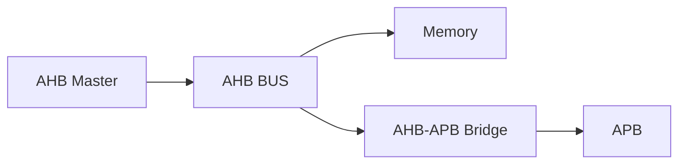
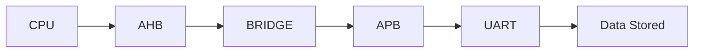

<h1 align="center"> AHB Bus (Advanced High-performance Bus) - Verilog RTL Design </h1>

<p align="center">


</p>

<p align="center">


</p>

---

<p align="center">
Implementation of <b>AMBA AHB</b> along with a simple <b>AHB Master</b>, enabling pipelined, burst-based high-speed on-chip communication and integration with APB.
</p>

---

# Overview

- High-performance on-chip bus protocol  
- Fully pipelined (Address + Data overlap)  
- Supports single and burst transfers  
- Configurable data width and address width  
- Used for CPU, memory, and high-bandwidth peripherals  

---

# AHB Architecture



---

# Core Components

- **Master (Manager)**  
  Initiates transfers (address + control generation)

- **Slave (Subordinate)**  
  Responds with data, ready, and response signals  

- **Decoder**  
  Selects slave based on address  

- **Multiplexer**  
  Routes read data and response back to master  

---

# Transfer Mechanism


- Address phase = 1 cycle (cannot be extended)  
- Data phase = 1 or more cycles  
- Overlapping enables **pipelining**  

---

# Basic Transfer Operation

- Master drives address + control  
- Slave samples in next cycle  
- Data phase follows  
- HREADY controls completion  

- Write → Master drives HWDATA  
- Read → Slave drives HRDATA  

---

# Types of Transfers

## Read Transfer


- HWRITE = 0  
- Slave → HRDATA  
- Master samples when HREADY = 1  

**Condition:**
- Valid when HTRANS = NONSEQ / SEQ  
- Data valid only when HREADY = 1  

## Write Transfer


- HWRITE = 1  
- Master → HWDATA  
- Slave captures data  

**Condition:**
- Address phase → control valid  
- Data phase → data valid  


## Read (No Wait State)


- No stall from slave  
- HREADY = 1 continuously  

**Condition:**
- Completes in 2 cycles  
- Address + Data  

## Write (No Wait State)


- Immediate completion  

**Condition:**
- HREADY = 1  
- No wait insertion  


## Burst / Multi Transfer


- Multiple transfers in sequence  

**Condition:**
- First → NONSEQ  
- Remaining → SEQ  
- Address auto-increment  

---

## HTRANS Encoding

| HTRANS | Type |
|--------|------|
| 00 | IDLE |
| 01 | BUSY |
| 10 | NONSEQ |
| 11 | SEQ |

- IDLE → no transfer  
- BUSY → pipeline stall inside burst  
- NONSEQ → first transfer  
- SEQ → remaining burst transfers  

---

# Burst Types (HBURST)

| HBURST | Type |
|--------|------|
| 000 | SINGLE |
| 001 | INCR |
| 010 | WRAP4 |
| 011 | INCR4 |
| 100 | WRAP8 |
| 101 | INCR8 |
| 110 | WRAP16 |
| 111 | INCR16 |

- Incrementing → sequential addresses  
- Wrapping → wraps at boundary  

---

# Transfer Size (HSIZE)

| HSIZE | Size |
|-------|------|
| 000 | 8-bit |
| 001 | 16-bit |
| 010 | 32-bit |
| 011 | 64-bit |
| 100 | 128-bit |

---

# Wait States

- Controlled using HREADY  
- HREADY = 0 → insert wait  
- Extends data phase  

---

# Locked Transfers

- Controlled using HMASTLOCK  
- Ensures atomic operation  

**Condition:**
- Lock asserted → no interruption  
- Used for critical sections  

---

# Signal Description

## Global

| Signal | Description |
|--------|------------|
| HCLK | Clock |
| HRESETn | Active low reset |

## Master Signals

| Signal | Description |
|--------|------------|
| HADDR | Address |
| HWRITE | Read/Write |
| HTRANS | Transfer type |
| HSIZE | Transfer size |
| HBURST | Burst type |
| HWDATA | Write data |

## Slave Signals

| Signal | Description |
|--------|------------|
| HRDATA | Read data |
| HREADY | Transfer complete |
| HRESP | Response (OKAY/ERROR) |

---

# Response Types

| HRESP | Meaning |
|-------|--------|
| 0 | OKAY |
| 1 | ERROR |

---

# AHB Bus Implementation

```verilog
assign s_haddr     = m_haddr;
assign s_hwrite    = m_hwrite;
assign s_hsize     = m_hsize;
assign s_hburst    = m_hburst;
assign s_hprot     = m_hprot;
assign s_htrans    = m_htrans;
assign s_hmastlock = m_hmastlock;
assign s_hwdata    = m_hwdata;

assign m_hrdata = s_hrdata;
assign m_hready = s_hready;
assign m_hresp  = s_hresp;
```

- Direct pass-through interconnect  
- Can be extended to multi-slave system  

---

# AHB Master FSM


- Generates control signals  
- Handles sequencing  
- Sync using HREADY  

---

# Data Flow



---

# Key Features

- Pipelined high-speed communication  
- Burst transfer capability  
- Efficient bandwidth utilization  
- Scalable architecture  

---

# Role in SoC

- Core high-speed backbone  
- Connects CPU and memory  
- Interfaces with APB for peripherals  

---

<p align="center"><b>
AHB enables high-performance, pipelined, and scalable communication in SoC designs, forming the backbone for efficient system-level integration.
</p>
  
---
